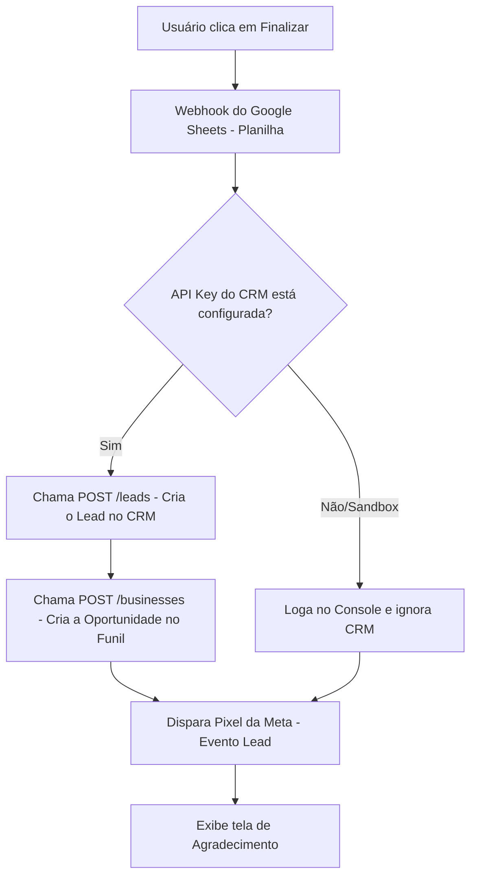

# Playbook de Integração: form_captura & DataCrazy CRM

Este documento explica o funcionamento da integração da API do DataCrazy CRM no formulário de Diagnóstico Estratégico da ViDi.

---

## 1. O que está sendo implantado?

Estamos adicionando um fluxo automatizado de envio de leads e negócios para o **DataCrazy CRM** a partir do preenchimento do formulário interativo de diagnóstico. 

O formulário funcionará de forma híbrida:
1. **Google Sheets (Via Webhook)**: Envia todas as respostas detalhadas das perguntas para a sua planilha existente.
2. **DataCrazy CRM (Via API)**: Envia o contato do lead e cria uma oportunidade de negócio no estágio desejado do funil.
3. **Facebook Pixel**: Dispara o evento de PageView (no início) e o evento de Lead (no encerramento).

---

## 2. Como a integração funciona?

Quando o usuário clica em **"Finalizar Diagnóstico ✓"** no último passo do formulário, a função `submitForm()` realiza as seguintes etapas sequenciais:



### Detalhamento das Etapas da API:
1. **Identificação e Criação de Lead (`POST /leads`)**:
   - Envia o Nome, E-mail e WhatsApp coletados no último passo.
   - Define o campo `source` como `"LP - Diagnóstico Estratégico"`.
   - Vincula a URL de origem (`sourceUrl`) no registro do lead.
   - Retorna um identificador único (`leadId`).

2. **Geração de Negócio (`POST /businesses`)**:
   - Utiliza o `leadId` retornado e o vincula a um estágio (`STAGE_ID`) do seu funil do CRM.
   - A partir disso, o lead aparece visualmente como um card na coluna correspondente do pipeline de vendas no DataCrazy.

---

## 3. Estrutura de Configuração no Código (`index.html`)

No final do arquivo `index.html`, incluímos uma seção de configuração isolada. Para ativar a integração real, você só precisará substituir os placeholders:

```javascript
const DC_CONFIG = {
  API_KEY: 'SUA_CHAVE_DATACRAZY_AQUI',   // Substitua pela chave gerada no CRM
  STAGE_ID: 'UUID-DO-ESTAGIO-DO-FUNIL',  // Substitua pelo ID da etapa do funil
  SOURCE_LABEL: 'LP - Diagnóstico Estratégico',
  TAG_IDS: []                            // Opcional: Tags adicionais do lead
};
```

### Como obter os dados necessários no painel do DataCrazy:
1. **API Key**: Acesse `https://crm.datacrazy.io/config/api`, crie uma chave com permissão de escrita e cole-a no campo `API_KEY`.
2. **STAGE_ID**: É o identificador interno da etapa do funil do CRM (ex: "Diagnósticos Recebidos"). Se necessário, podemos executar uma chamada auxiliar para listar suas etapas e extrair esse ID.

---

## 4. Benefícios e Robustez

* **Independência de Falhas**: Se a API do DataCrazy estiver indisponível ou lenta, o envio das informações para o Google Sheets não será interrompido, e vice-versa.
* **Segurança client-side**: O tratamento de rate limit da API (HTTP 429) está embutido para evitar perda de dados.
* **Rastreabilidade**: A origem do lead e o link exato da landing page são salvos, permitindo rastrear de onde veio o preenchimento.
